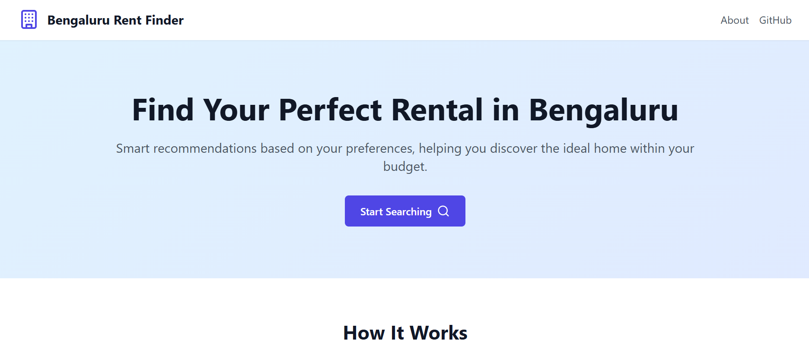
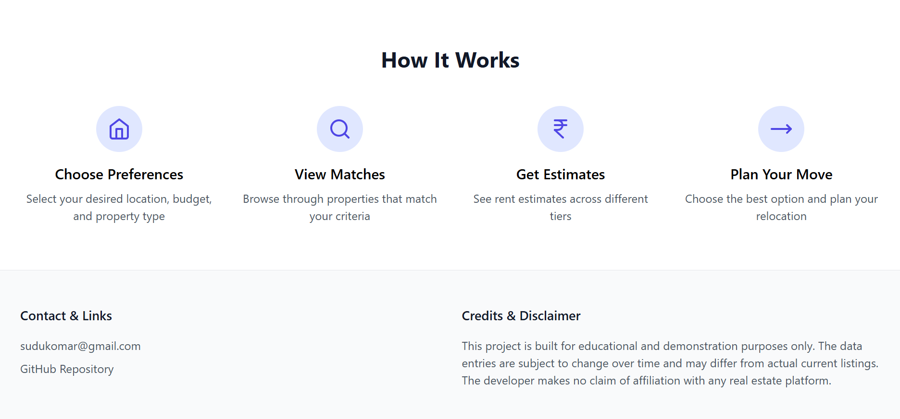
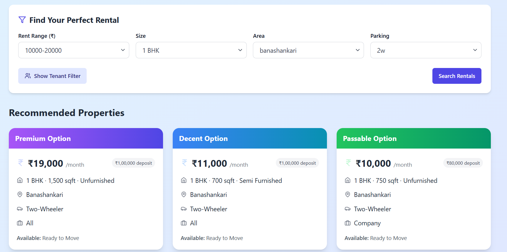


# Bengaluru Rent Finder 🏠

## Project Overview 🎯
Bengaluru Rent Finder is a **web app** designed to help users find rental properties in **Bengaluru** based on their preferences. The app filters a dataset of rental listings to provide three types of recommendations:

- **Premium**: Highest rent match 💰
- **Decent**: Median rent match 👍
- **Passable**: Lowest rent match 🏠

## How It Works 🔧
1. **Data Loading**: The app loads a dataset of **~6.5k rental listings** from a CSV file 📊.
2. **User Filters**: Users can filter properties based on:
   - Rent 💵
   - Size 📏
   - Area 🌍
   - Parking 🚗
   - Tenant Preference (optional) 👥
3. **Recommendations**: Based on user selections, it shows three recommendations:
   - **Premium**: Highest rent match
   - **Decent**: Median rent match
   - **Passable**: Lowest rent match
4. **UI**: The app features a **modern, interactive UI** built with **React** and styled using **Tailwind CSS** 🎨.

## Features 🌟
- **Interactive Filters**: Select filters for Rent, Size, Area, and Parking.
- **Instant Recommendations**: Shows the top three rental properties instantly.
- **Responsive Design**: Optimized for both desktop and mobile 📱💻.
- **User-Friendly Interface**: Clean and modern design for an intuitive experience.
## Demo 🎥

Check out the live demo: [Bengaluru Rent Finder](https://rent-prediction-next.vercel.app)  
(Note: It may take a minute to load)

## Run Locally

Clone the project

```bash
  git clone https://github.com/SudarshanKomar/rent-prediction
```

Go to the project directory:

```bash
  cd rent-prediction
```

Install dependencies

```bash
  npm install
```

Start the development server:

```bash
    npm run dev
```


## 📸 Screenshots

### 🏠 Home Page





### 🔍 Search Page


## Web Scraping (For Educational Purposes)

You can use web scraping to collect rental data for educational purposes. Ensure to follow ethical guidelines and the website's terms of service.

Refer to this [Colab notebook](https://colab.research.google.com/drive/13UWC-JXjyY9ul-vZg4zhy8X0xxMXcDB8?usp=sharing) for a sample scraping code.

## 🙏 Acknowledgements

- Inspired by real-estate listing platforms 🏘️
- Built using **React** and **Tailwind CSS**
- Thanks to open-source tools and the amazing developer community.

